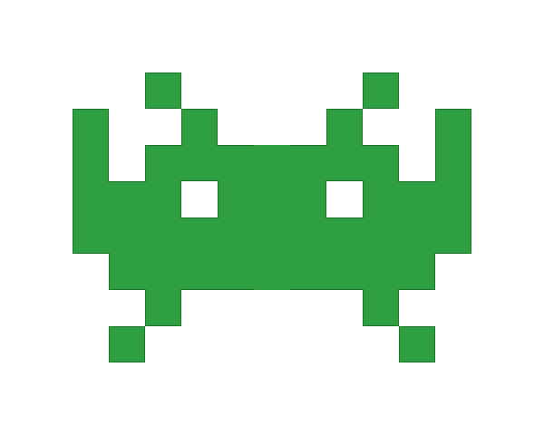

 <h1 align="center"> This is Eric's place </h1>

&nbsp;

 

  

    
 Profissional em procrastinar. Especialista em me redimir no prazo. 📅 Ganhador da copa mundial de truco (2003). Super-herói apenas nos finais de semana 🦸‍♂️ Sobrevivente de reuniões que poderiam ter sido e-mail. Dormir é meu esporte principal 💤 Aprendiz de mago, mestre em meme antigo. Dono de uma playlist pra cada humor e de um humor pra cada situação. Funcionando a base de café, esperança e ctrl+Z.

    <break>
     

<h2 align="center" font-size="20px"> trabalhando atualmente com </h2>
 

    
    &nbsp;
    
    &nbsp;
    
    &nbsp;

